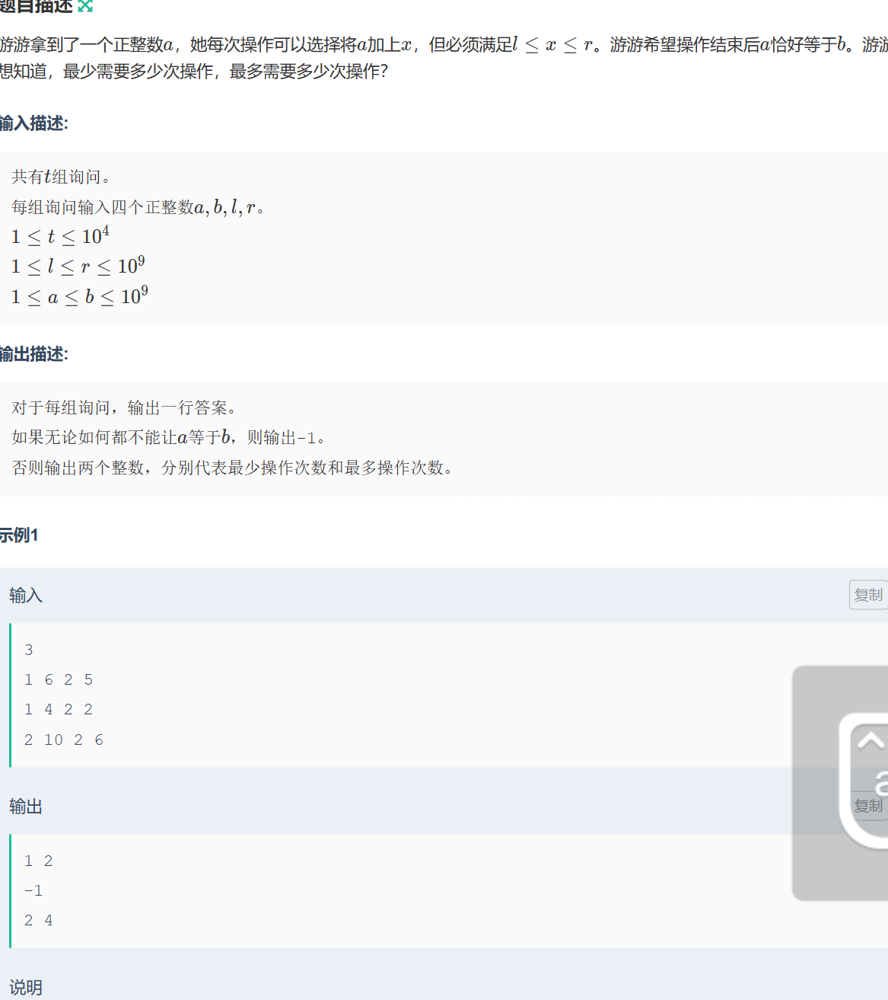

-    模拟  
     -    技巧
             - 在写题目的时候，尽量能够手写写下来，因为脑子终归是没有那么多的专注小球的
             -    在写代码的时候能够进行模块化，就进行模块化分类
             -    把重复使用到的概念，进行统一转化，比如以前做过的题目“yy-mm-dd-hh-分钟-秒”的话，这样子把所有的时间进行转化成为秒，然后使得计算更加简便
             -    调试的时候，模块化可以很简单的找到问题的出处  
             - ==写代码不能够想到什么写什么，因为我的脑子没有那么好使！一定记住==
     - 例题 
-    双指针/尺取法 (双指针的算法是基于贪心的)
     -    条件：连续序列，且一旦超过某个上限条件前指针停止，后指针动，不可能出现后指针。或者换种说法，在不需要双指针的情况下，该题目的解已经可以写出，仅仅只需要双指针该算法来进行优化，并且双指针不会改变解题的逻辑。
     -    作用：双指针只能在上述条件中才能够使用
     -    技巧 : 就只要能够将前后指针移动的条件写清楚，就可以了（主要靠逻辑能力）
     -    [例题一](https://codeforces.com/contest/1873/problem/F) 
     
-    递归
-    贪心和拟阵
     -    拟阵和相应的集合论
-    dp动态规划
     -   0/1背包
     -   完全背包
-    前缀和/差分

     -   一维  
     -   二维
     -   三维
-    树状数组

     -   单点
     -   区间
     -   一维
     -   二维
     -   三维
-    线段树
-    二分
-    
     -   整数
     -   实数
     -   平均步长
         -   牛客周赛 round7 左右有一道例题目
-    离散化（其实是聚合 傻逼名字）
-    倍增
-    ST表
-    分治
-    树与二叉树
-    搜索

     -   BFS
     -   DFS
-    并查集
-    递推 和 模拟有什么区别 ？？（没什么区别，递推是一种比较重要的模拟，并且是递归dp等算法的基础）
-    stack用到的很少不是很会用

#### 我会了什么

    -   语法方面
    
    -   stl库里面（还渐渐会看 网站上面c++ preeference的描述了，渐渐也不用依靠别人了）
    
        -   map  
    
        -   vector 一维二维
    
        -   pair 的各种嵌套
    
        -   auto
    
        -   operator
    
        -   虽然还不会写类
    
        -   
    
                        ​	

##### 人脑测试题（反正我是不知道自己到底哪里是抽搐的了）

1、是否存在有解
2、最大与最小的判断
3、数据量大小
// 确实当不确定值，出现多个的时候，根本不会想到数据量的问题；，所以还是建议开头就直接写成i64；避免失误，但是，那我的思维逻辑还是没有被完善啊，（存疑）

