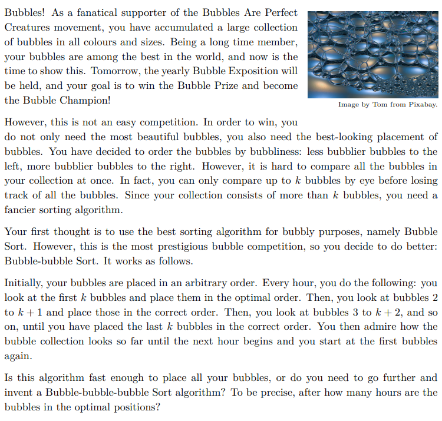

### QUESTION1 :  next是关键字 ？？ 为什么定义为next数组 会报错 说是他the declare  of next is ambiougous


### QUESTION2: 为什么 sort 在for循环里面就会死循环呢


``````c++
#include <algorithm>
#include <iostream>
#include <map>
#include <utility>

using namespace std;
const int N = 1e5 + 10;

int a[N], b[N], n;
int check() {
  for (int i = 1; i <= n; i++) {
    if (a[i] != b[i]) {
      return 1;
    }
  }
  return 0;
}
int main() {
  int k;
  cin >> n >> k;
  map<int, int> mp;
  for (int i = 1; i <= n; i++) {
    cin >> a[i];
    b[i] = a[i];
  }
  sort(b + 1, b + n + 1);
  int ans = 0;
  while (check()) {
    cout << endl;
    // 为什么sort 出不去
    for (int i = 0; i < n - k; i++) {
      sort(a + i, a + i + k - 1);
    }
    ans++;
  }

  cout << ++ans;
  return 0;
}


``````

### QUESTION 3 : 对于二位数组所能够做到的一些带有权值的图形，不够熟悉

、
、
、
、
、
、
、
、
、
、
、
、
、
、
、
、
、
、
、
、
、
、
、
、
、
、
、
、
、
、


## 人本身

-   我对于问题拆解，然后检查的能力有所偏差  >>>>  也就是说，我对于模拟的思维模式 // 现在依然会有对于完全进行模拟的情况有所不完备，（属于是基础题目做的太少了，比如对于二维数组的下标没有很熟悉，以至于 写一些回环问题，或者其他的一些和下标有关的问题，不能够很迅速，导致后面的dp等等需要综合运用的时候，脑子会是一团浆糊）
-   或者说是我本身的思维逻辑依然是跳脱的，所以需要加以训练以得到约束，或者说是得到控制的应用；
-  问题 -- 对于自己是否掌握某一个知识点不够自信，并且会有相应的数组范围等小问题，同时掺杂在一起，会导致一时找错方向。


- **1、划分为可用的数据结构/容器 去存储**
  - **依据所具有的标识数量/也就是涵盖的信息的不同种类，和相应的逻辑关系，进行选择**//这里我经常摇摆不定，说明其实我对于stl容器，和其中题目的逻辑关系摸不太清楚。
- **2、算法选择，也会影响 -> 1**
- **3、** 