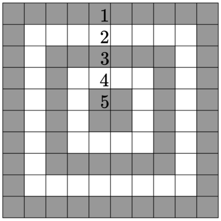

### QUESTION 3: 二维数组

$$1、\qquad {x = i ,y = j,len = n} \qquad value =min(i,j,n-i,n-j) $$

**一般，这种有关于二维数组的题目，总是会形成一个轴对称的图形，比如左上和右上的图形，左下，右下，四个是呈现出中心对称的，在这一道题目里** 
[题目链接：codeforce-div4-c](https://codeforces.com/contest/1873/problem/C)

### QUESTION 4 : 平均数

何种情况，会应用到这种情况呢，当题目中出现 +1，-1等情况的时候，会去用到平均数
众数：[题目链接平均数1--newcoder](https://ac.nowcoder.com/acm/contest/63869/D);

### QUESTION 5 : 中位数

比如说每人都会有一票，然后投离自己最远的一个的时候，会用到中位数。
// 已经找不到例题了总是记得是牛客上的。